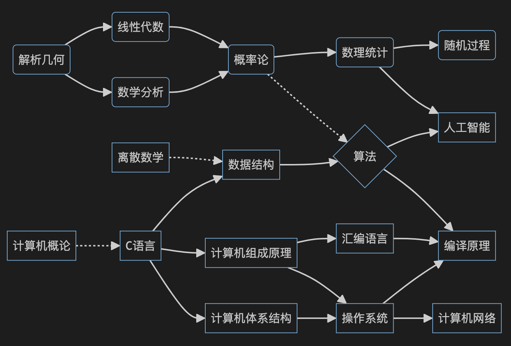

# 程序员自学指南(书籍推荐)
> 数学核心课程和专业核心课程是非常重要的
> 其他的可以像缓存一样，需要的时候再查阅或者学习

## [数学核心课程](./数学核心课程/README.md)
- [高等数学](./数学核心课程/高等数学/README.md)
- [线性代数](./数学核心课程/线性代数/README.md)
- [解析几何](./数学核心课程/解析几何/README.md)
- [离散数学](./数学核心课程/离散数学/README.md)
- [概率论与数理统计](./数学核心课程/概率论与数理统计/README.md)

## [专业核心课程](./专业核心课程/README.md)
> 以下顺序几乎就是学习顺序
- [计算机组成原理](./专业核心课程/计算机组成原理/README.md)
- [计算机体系结构](./专业核心课程/计算机体系结构/README.md)
- [C语言](./专业核心课程/C程序设计语言/README.md)
- [数据结构](./专业核心课程/数据结构/README.md)
- [算法](./专业核心课程/算法/README.md)
- [操作系统](./专业核心课程/操作系统/README.md)
- [编译原理](./专业核心课程/编译原理/README.md)
- [计算机网络](./专业核心课程/计算机网络/README.md)

## 非核心课程
- 数字电路
- [汇编语言](./非核心课程/汇编语言/README.md)
- [数据库系统](./非核心课程/数据库系统/README.md)
- 软件工程

## [经典推荐](https://www.douban.com/doulist/156598271/)
- [Stevens经典6本](./经典推荐/Stevens经典6本/README.md)
- [计算机程序的构造和解释](./经典推荐/SICP/README.md)
- [设计模式](./经典推荐/设计模式/README.md)
- [重构](./经典推荐/重构/README.md)
- [代码大全](./经典推荐/代码大全/README.md)
- [凤凰架构](./经典推荐/凤凰架构/README.md)
- [编程珠玑](./经典推荐/编程珠玑/README.md)
- [数学之美](./经典推荐/数学之美/README.md)
- [人月神话](./经典推荐/人月神话/README.md)
- [程序员最值得推荐的十本书](https://zhuanlan.zhihu.com/p/668703498)
- [Peter Norvig：自学编程，十年磨一剑](https://zhuanlan.zhihu.com/p/674702263)

## 领域好书
- [Shell](./领域好书/Shell/README.md)
- [VIM](./领域好书/VIM/README.md)
- [Git](./领域好书/Git/README.md)
- [Jenkins](./领域好书/Jenkins/README.md)
- [Docker](./领域好书/Docker/README.md)
- [Kubernetes](./领域好书/Kubernetes/README.md)
- [Prometheus](./领域好书/Prometheus/README.md)
- [python](./领域好书/python/README.md)
- [golang](./领域好书/golang/README.md)
- [MySQL](./领域好书/MySQL/README.md)
- [Redis](./领域好书/Redis/README.md)
- [ElasticSearch](./领域好书/ElasticSearch/README.md)
- [HTML](./领域好书/HTML/README.md)
- [CSS](./领域好书/CSS/README.md)
- [JavaScript](./领域好书/JavaScript/README.md)
- [正则表达式](./领域好书/RE/README.md)
- [内核源代码阅读](./领域好书/内核源代码阅读/README.md)

## 避坑指南
- [程序员修炼之道](./避坑指南/程序员修炼之道/README.md)
- [数据密集型应用设计](./避坑指南/数据密集型应用设计/README.md)
- [HTML5秘籍](./避坑指南/HTML5秘籍/README.md)
- [数据结构与算法分析](./避坑指南/数据结构与算法分析/README.md)
- [深入理解计算机系统](./避坑指南/深入理解计算机系统/README.md)
