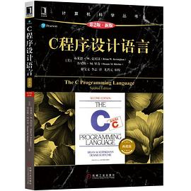

# C语言

> C语言是唯一一门进入核心课程的高级语言。后续的课程中，几乎每一门软件方面的课程都需要写部分代码，这些代码无论是什么语言，都收到C语言的影响。掌握了C语言，加上部分合理的想象力，就可以理解其他核心课程中
其他语言编写的代码片段了。
> 
> C语言内核非常的小，简洁而干净，就一个内存模型。如果你会用二级指针，基本上就掌握C语言了。
> 

强烈推荐两本书

## 0. C语言程序设计：现代方法

最好的C语言教材了，没有之一。

C语言是如此的重要，如果你看这本书还学不会C语言，请再考虑考虑是不是不适合学计算机

## 1. C程序设计语言

唯一必读的C语言教材，作者就是C语言设计者。这本书非常的简明，初学者读起来没有那么容易。如果看不懂，请移步第一本，稍后以后再回来。
