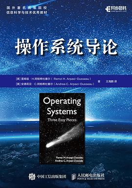
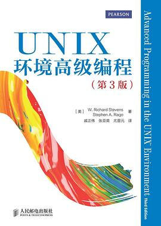
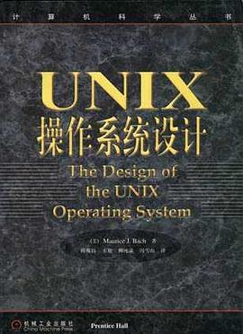
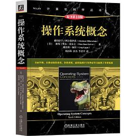
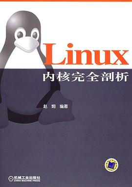

# 操作系统
> 操作系统向下对接硬件指令集，对上提供资源抽象，学习和掌握操作系统对排查问题，设计大型软件，都非常有价值

## 0.操作系统导论

非常棒的一本书，内容好理解有深度，特别是锁和文件系统部分。还有就是启发式的问答非常生动并且不啰嗦，实在是难得的好书。建议作为教材

## 2.UNIX环境高级编程

程序员最重要的一本书。
本书带着你翻一遍UNIX操作系统的接口，顺便揭示内部实现的工作原理。
程序员必读

## 2.UNIX操作系统设计

这本书是讲操作系统内核的数据结构和算法的，如果有足够好的编码能力，完全可以基于本书的伪代码描述实现自己的操作系统内核了。Linus在写linux的时候，就是参考了本书。本书内容有点老，通过他可以看到内核最本质的东西。本书质量上乘，上市之后没有修订过就是证明

## 3.操作系统概念

本书既有深度又有广度，极大的开拓了视野，特别是对目前的移动设备，多核计算和并行计算的介绍，非常引人入胜。但是个人认为本书并不是最好的第一本操作系统教材。个人认为最好的是那本叫《操作系统导论》的蓝皮书，那本书很深度但是广度上不如本书。

## 4.Linux内核完全剖析

本书通过代码展示了操作系统最核心的组成。适合没有基础但是想看内核源代码的你。本书描述的内核版本，代码只有两万行。

阅读内核代码的好处：
- 对进程有一个非常直接了当的理解，为什么会返回两次，不用隔靴搔痒。
- 对中断时计算的反应有一个直接了当的理解，信号为什么会丢。
- 对文件有一个直接的了解，操作系统是怎么抽象文件和目录的。

> 最后两本属于扩展阅读范围，也是推荐的好书
