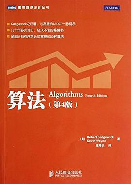

# 数据结构

> 数据结构是比较基础的课程，对比起来也没有那么难

## 教材：算法4红皮书

强烈推荐

本书是最好的数据结构和算法基础书籍

数据结构和算法本来是分不开的，如果硬要区分，这本书更像是数据结构的教材。本人自学时看过一本国产的，李春葆老师的《数据结构教程》，也还不错。不过内容被这本书完美覆盖。

对大部分开发来说，掌握这些算法也就够了。本书比较好的一点是整体性很强，前面两章的数据结构封装，后面直接使用，这可以极大的缩减代码行数。 另外就是取材也很不错，以前看红黑树都似懂非懂的，这里使用2-3-4树作为理论工具，让红黑树的添加和删除逻辑都很简单。第五章的压缩算法，有正向思维的也有逆向思维的真是大开眼界，不看书很难想到。总之每一页都很精彩。
插图堪称完美！
