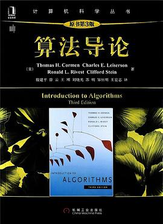
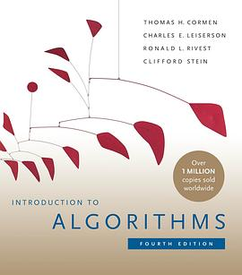

# 算法
> 算法对于程序员的重要性，怎么强调都不为过，甚至可以说「程序世界一切都是算法」

## 教材

地球上最好的算法教材。

除了数据结构那本教材「算法4红皮书」，不再需要推荐其他的通用的算法书籍了。

由于使用很多数学概念，大部分算法都一句话就可以解释清楚了，非常的简洁准确。

另外值得一提的是：每章的习题和注记简直是宝藏。不掠人之美是美好的品德。

对比千奇百怪的算法，本书叫「算法导论」是非常准确的。

第四版中文版还没有出。

第四版的改变有几个地方还是挺期待的：

1.稳定匹配问题。

2.有一章联机算法。旧版绝大部分是脱机算法

3.有一章机器学习算法。

4.彩色排版。更好辨识

5.几个难的章节被删除了。比如使用拟阵讲贪心算法（太可惜了，感兴趣的可以看第三版），斐波那契树（其实我觉得有点可惜），van Emde Boas(这个是第二版新加的，确实很鸡肋，渐进复杂度低但是前面那个常数也太大了)
