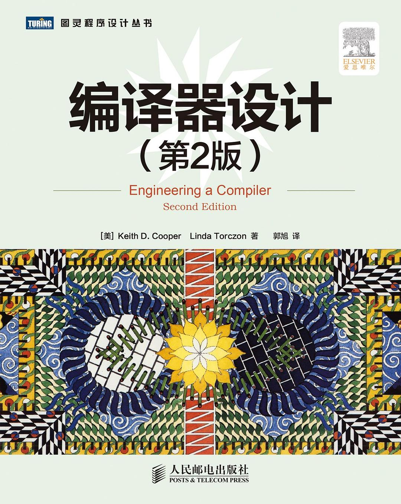
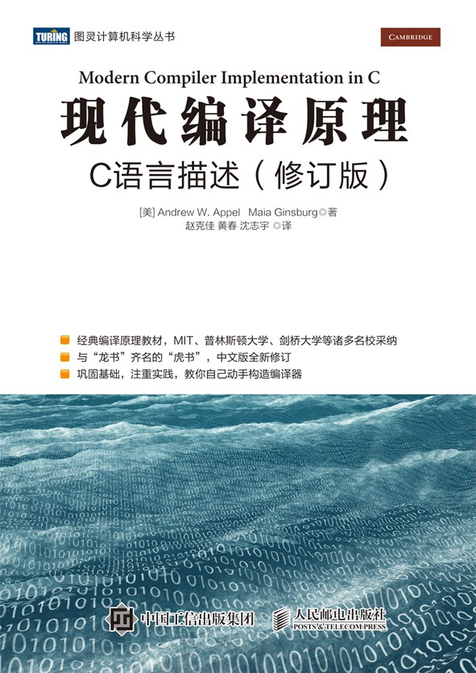
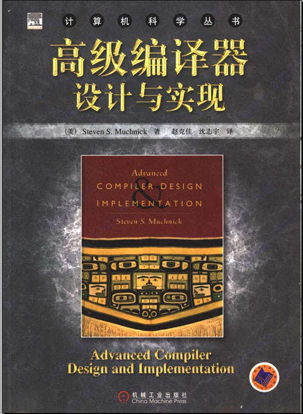

# 编译原理

> 编译原理是计算的大脑。对于一个有追求的程序员来说，不能透彻掌握编译原理，一定会成为心结。这就是为什么国内外都觉得编译原理难。
> 
> 编译原理涉及到形式语言，计算机硬件(流水线和cache局部性)，图论，动态规划，等等一系列的知识，让你在别的课程里学到的知识变活了。
>
> 学习编译原理之前，最好已经完全掌握《算法》第四版红皮书的内容。要不然陌生的东西太多，接受不过来。如果只是陌生的概念，背后的技术是熟悉的，那就轻松很多。

## 0.编译器设计

最好的「编译原理」教材。 

自顶向下的设计思维，先有框架再在框架下解决一个个的技术问题，机制和策略完全分离。对不动点计算的反复运用。如果能够以构造的方式证明描述，构造过程就是证明过程，找到不动点的时候构造结束。虽然运行效率不高，但是这个表达方式绝对是高维视角。

在大学课程里也许会觉得编译器前端比较难，其实最难的是优化，完全是开放式问题，你需要基于自己的思考，建模，设计数据结构和算法

里面会用到很多图算法，最好先看看《算法》第四版红皮书

本书与龙书的区别就是：距离工程实现，龙书千里之外，本书一步之遥

## 1.编译原理

龙书，第一版是C语言，第二版改为Java。
看过第一版，前四章绝对是经典，后面章节对优化的介绍不够，整体更偏原理。不推荐作为第一本教材学习这门技术

## 2.现代编译原理

虎书，C语言版本。我没有看过

## 3.高级编译器设计与实现

鲸书，偏重后端代码优化。我没有看过