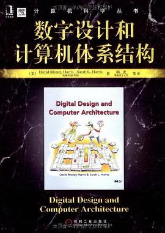
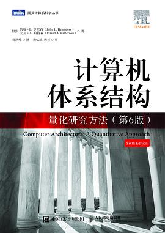

# 计算机体系结构
> 计算机组成原理和计算机体系结构都同属硬件
> 前者偏机制，更强调实现
> 后者偏策略，更强调接口

## 1.数字设计与计算机体系结构

前面讲电路，中间讲组成原理，后面讲体系结构。这样把三者集合起来，让读者能够透视计算的工作原理。推荐他的原因之一是确实写得不错，原因之二是第二本确实太难了

## 2.计算机体系结构：量化研究方法

这本才是经典。P&H一起因为计算机体系结构的贡献获得过图灵奖。不过很遗憾我没有看完，特别作此说明

## 3.深入理解计算机系统

本书也是名声在外。不过我觉得定位有点尴尬。我也没有看完拿过。
