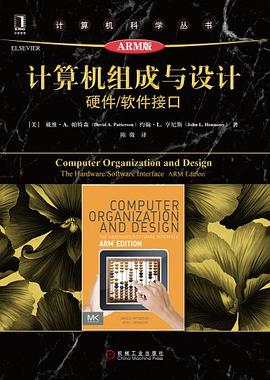
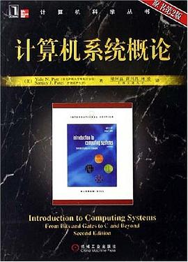

# 计算机组成原理
> 计算机组成原理和计算机体系结构都同属硬件
> 前者偏机制，更强调实现
> 后者偏策略，更强调接口

## 0.计算机组成与设计

这本书其实也涵盖了部分体系结构的内容，不过不用分的这么清，这本书非常扎实，里面的插图非常细致精美，作者曾经获得过图灵奖。本书也挺有难度的，如果阅读时感觉吃力，应该选择第二本

## 1.计算机系统概论

这本书使用最短的篇幅传达了计算机最本质的东西，尤其适合0基础的学生。
本书不需要任何先修课程。学完后你将掌握，CPU是如何工作的，内存是如何寻址读写的，汇编语言的原理，C语言翻译为机器语言内存模型，指针和C语言的过程
掌握这本书之后，对很多底层的概念有了一个深刻的认识，后续的课程应该就是轻松加愉快的了。
本书的深度是不够的，没有超标量流水线，乱序执行，cache一致性方面的内容。虽然这些都是非本质的东西，但是依然很重要。需要从第0本找补回来。

> 对于完整掌握程序设计来说，这两本书是必读的