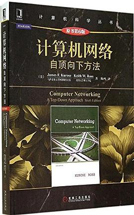

# 计算机网络

> 计算机网络成了最近几年最活跃，最有创新力的地方。比如云原生，高度依赖对计算机网络的深刻理解。

# 0.计算机网络：自顶向下方法

最好的计算机网络介绍教材。

阅读时请认准第6版。最后一个经典版本，后面的版本改为语义网，反而掩盖了网络工作原理的本质。

我看过这本书很多个版本。

# 1.TCP:IP详解(卷1)
.jpg)

本书被若干严肃的书籍和论文引用。百度百科的网络相关的词条是一字不错的抄自本书。这可以说明本书原版和翻译版质量之高，本书通过网络运行的现象解释网络协议的工作原理，独辟蹊径，非常高明。 

第一卷必读。

注意，认准第一版。第二版的更新非常啰嗦，翻译质量也不敢恭维。
