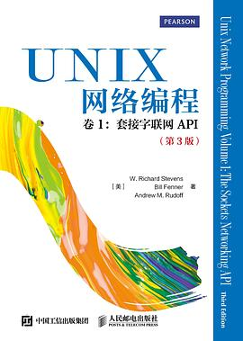
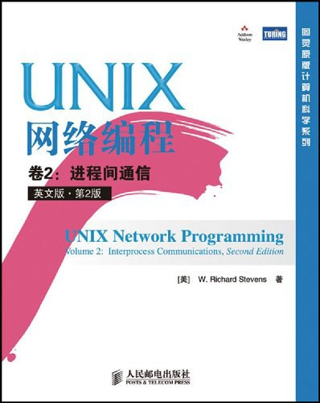
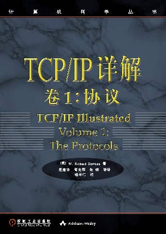
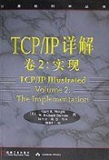

# W·Richard Stevens
> 唯一号称「伟大的技术书作家」的人

## 1. UNIX环境高级编程

推荐指数：⭐️⭐️⭐️⭐️⭐️

本书简称APUE，是程序员必读书籍

## 2.UNIX网络编程 2册

推荐指数：⭐️⭐️⭐️⭐️⭐️

本书内容太过于震撼了：
- 可重入与不可重入
- 阻塞与非阻塞
- 长肥管道
- 可靠信号与不可靠信号
- 跨进程传递文件描述符
- 多进程多线程
- 进程池线程池
- 惊群效应
- inetd模型
- icmpd
- bpf
如果你想对以上这些概念有一个准确的把握，这本书是最快的。

本书的讲述的简洁而准确。不过读起来也不轻松。成长伴随着痛苦

推荐指数：⭐️⭐️⭐️⭐️

这本书除了最后一章，前面的是讲同一台主机上的进程之间通信的各类方法的，比较有价值的是各个案例代码，绝大部分内容都被APUE和UNPv1覆盖了，可以不用看。
第一卷是真的震撼，看完以后明显感觉进入了一个全新的境界，推荐大家认真阅读第一卷。
读了第一卷以后，这一本读起来就没有那么痛苦了。

## 3.TCP/IP详解 3册

推荐指数：⭐️⭐️⭐️⭐️⭐️

本书被若干严肃的书籍和论文引用。百度百科的网络相关的词条是一字不错的抄自本书。这可以说明本书原版和翻译版质量之高，本书通过网络运行的现象解释网络协议的工作原理，独辟蹊径，非常高明。 

第一卷必读。

注意，认准第一版。第二版的更新非常啰嗦，翻译质量也不敢恭维。

本人没有读过卷2

本人没有读过卷3
