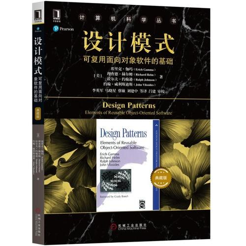

# 设计模式

## 设计模式 GoF

推荐指数：⭐️⭐️⭐️⭐️⭐️

GoF是无价的设计模式材料，这本书的安排可读性高，编排很有秩序，很容易后续查缺补漏，或者作为设计模式字典。

初接触设计模式一般都比较懵，一开始就看GoF会有点吃力，那好，再推荐一本开胃菜----head first 设计模式

## Head First设计模式

推荐指数：⭐️⭐️⭐️⭐️

如果一本书很经典，但是你看不懂，那跟你有什么关系呢，没错我说的就是GoF。但是如果你看了这本，GoF就100%能看懂了。这本书不是为了取代第一本，而是为了帮你彻底掌握第一本，设计模式的定义，使用场景，历史典型例子都在GoF里。
