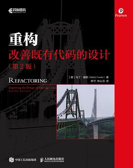

# 重构： 改善既有代码的设计

推荐指数：⭐️⭐️⭐️⭐️⭐️

本书带来的好处是直接了当的，立竿见影的。

这是教程序员写好代码的书，全是只涉及代码层面，如果你想更多的学习架构，可以参考《代码大全》和《凤凰架构》。但是如果你想写出引以为傲的代码，这本书对你的帮助是最大的，本书作者非常具有工匠精神。非常细致的讲解。值得反复阅读和模仿，另一本是《设计模式》，可惜日常业务代码不太用得上设计模式。
