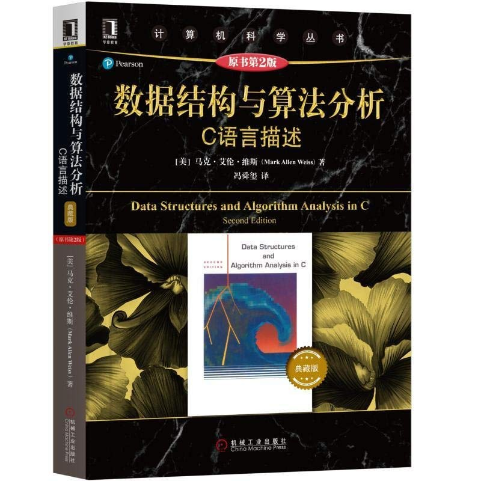

# 数据结构与算法分析

推荐指数：⭐️不推荐

这本书看上去很薄，其实内容很多，导致的结果就是：几乎每一个点都没有讲透。
也许有人会说对于聪明人来说这个程度就够了，其实如果很聪明就不会看这本，直接看《算法导论》不好吗，那本讲的方式更加灵巧，视角更加高级。
形式化的东西难懂，但是一旦掌握，不但好理解，而且很美。
启发式的东西好学，但是碎片化严重，很难从整体上掌握，且毫无美感可言。
所以显而易见形式化处理从品味上优于启发式处理。
本书将很多原本可以形式化讲述的算法，使用启发式思维把他撕碎，整体视角顿失，盲人摸象，美感全无，品味不再。实在是愚蠢。

如果你是初接触算法，推荐Robert Sedgewick的《算法》红皮书，这本书很细致，对初学者特别友好。
如果你是想进阶算法，推荐《算法导论》，该书的观点很高级。讲述很准确
