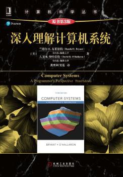

# 深入理解计算机系统

> 本书直译叫《程序员眼中的计算机系统》

本书定位有点尴尬，包含的东西太多了。结果就是对新手初学者有难度，对熟手又不够深入。
但是第一章讲解程序运行的那个例子已经值回定价了。所以我的建议是:
> 看完第一章就丢到一边吃灰

我实在是搞不懂豆瓣为什么这么高评分。
我猜估计很多人是因为他的名气想看，然后就去追加满分评价了。

为了做一个负责任的评分或者推荐人，特意花了点时间把他看完。整体的感觉就是，翻译的术语与当下比较吻合，翻译质量很高，但是也掩盖不了原作的不明确的定位。

我最多给三星。计算机有很多好书，这本书可以不看，Yale Patt的《计算机系统概论》可以完美替代本书的存在。
