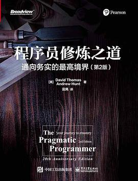

# 程序员修炼之道

不值得看。

作为一个程序员，之前老是感觉逻辑和数理能力才是关键。但是最近一段时间看过《重构》和《设计模式》以后，是觉得真的不错，心理也逐渐发生了变化。

所以这本书也弄来看了一遍。说说感受：

首先，这本书可读性真的很差，断断续续的看完，有时候实在是觉得无聊，放弃又不是我的风格

其次，本书几乎没有干货，如果真想深度了解软件构建过程，可以看《代码大全》，《代码大全》涉及的深度广度都是这本书比不了的。

最后，这本书写的那些教条一样的东西，像程序世界的《增广贤文》，是真理也是常识，不值得这么高的赞誉。

再说一遍：不值得浪费时间看