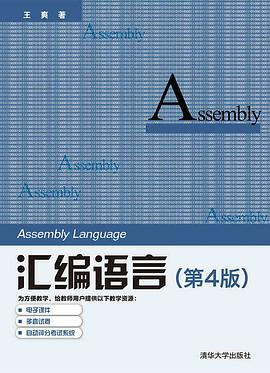

# 汇编语言
> 如果从事底层开发，比如操作系统或者数据库管理系统，或者编译器系统。可能需要完整的掌握汇编语言。

## 0.汇编语言

汇编语言最佳入门教材，本书豆瓣评分9.6

王爽老师证明，在一个细小领域做到极致，也能赢得大家的喜爱。

本书适合0基础的初学者，以简洁的方式教会你计算机是如何思考的。 但是不止于此。本书还代码解释了io设备的统一编址和独立编址 本书也代码解释了什么是轮询，中断，DMA还记得当初阅读本书的体验。

## 1.Programming the 80386

本书作者来自intel，但是本书可读性很高

本书系统的介绍了80386对多任务的支持，是当年写操作系统的人必读书，linus在实现linux是曾经仔细阅读本书

## 2.Programming the 80386

本书和王爽《汇编语言》堪称国产汇编教材双璧。 王爽那本偏重启发式引导学习，教会学生思考汇编模式 这本比较完整，覆盖了保护模式和实模式之间的切换，内存分页，进程切换，是学习操作系统之前看的不可多得的好书籍。本书部分高级主题来自《programming the 80386》 本书又叫黑皮书 别的汇编语言教材讲寻址模式，IO编址，io处理的轮询，中断，DMA，中断向量，然后就没有了。 这本书还包括，保护模式和实模式切换，进程切换，段描述符表，内存分页管理。 对理解「硬件对多任务系统的支持」很有帮助，这样的好书应该不多，我只知道这一本。 缺点就是，现在RISC横行天下，x86属于复杂指令集。
