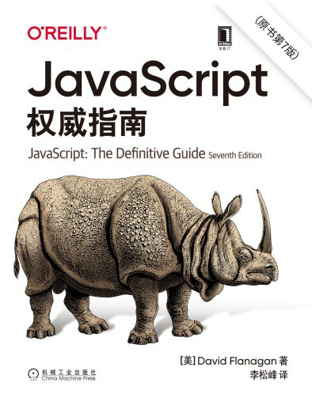

# Javascript好书推荐

## 1.JavaScript权威指南

推荐指数：⭐️⭐️⭐️⭐️⭐️

本书是JavaScript的最重要的一本书。或者也可说是唯一必读。

如果你想通过只读一本书掌握JavaScript的话，就是这本。 本书以前是绿皮砖头，包含了很多可以直接查阅的手册内容，新版去掉了那一部分，使得内容组织更加合理。变薄可以节约时间和金钱。

## 2.JavaScript语言精粹

推荐指数：⭐️⭐️⭐️⭐️⭐️

本书不是必读，推荐的原因是印象实在是太深刻了，里面充满了精妙的代码片段，另外本书很薄，不会花费太多时间和空间。里面的编码技巧非常值得学习和模仿。

## 1.React学习手册

推荐指数：⭐️⭐️⭐️⭐️⭐️

再推荐一本react相关的，因为react实在是太好用了。react让我们跟jQuery时代那种碎片化的代码说拜拜。react的组件让html和js紧密结合，对处理相关逻辑和封装都大有好处。钩子让处理生命周期更佳紧凑。

也许你不需要一本react的书，但是本书真的很好，以最短的篇幅讲解react最核心最本质内容，必会让你以最快的速度学会react。