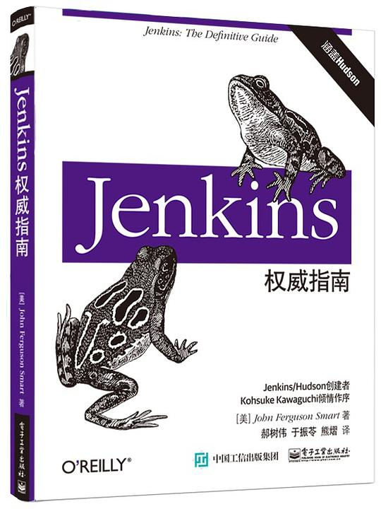

# jenkins好书

## 1. Jenkins 2.x 实践指南

推荐指数：⭐️⭐️⭐️⭐️

本书的操作性不太强，不过作者非常完整的介绍了jenkins能够做什么，算是一本及格的介绍jenkins的书，感兴趣的可以看一下。 通过本书的介绍，你会知道jenkins真的很了不起

## 2.Jenkins权威指南

推荐指数：⭐️⭐️⭐️⭐️

这本书比较完整的介绍Jenkins，如果你想通过读书完整理解Jenkins，你别无选择