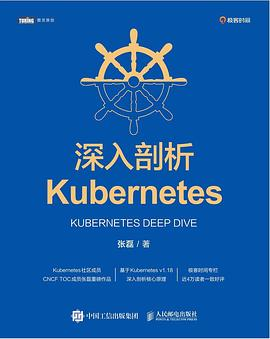

# Kubernetes好书

## Kubernetes in Action中文版

推荐指数：⭐️⭐️⭐️⭐️⭐️

介绍k8s最好的书籍。完整的看过两遍，可读性非常高，期待第二版，第二版本来计划23-08-26出版的，不知怎的延迟到24-03-26了

## 深入剖析Kubernetes

推荐指数：⭐️⭐️⭐️

书的内容还是不错的。就是给人一种高一脚低一脚的感觉，定位不清晰，抽象层次不统一，再加上封面的轴不是7根，三颗星不能再多了
