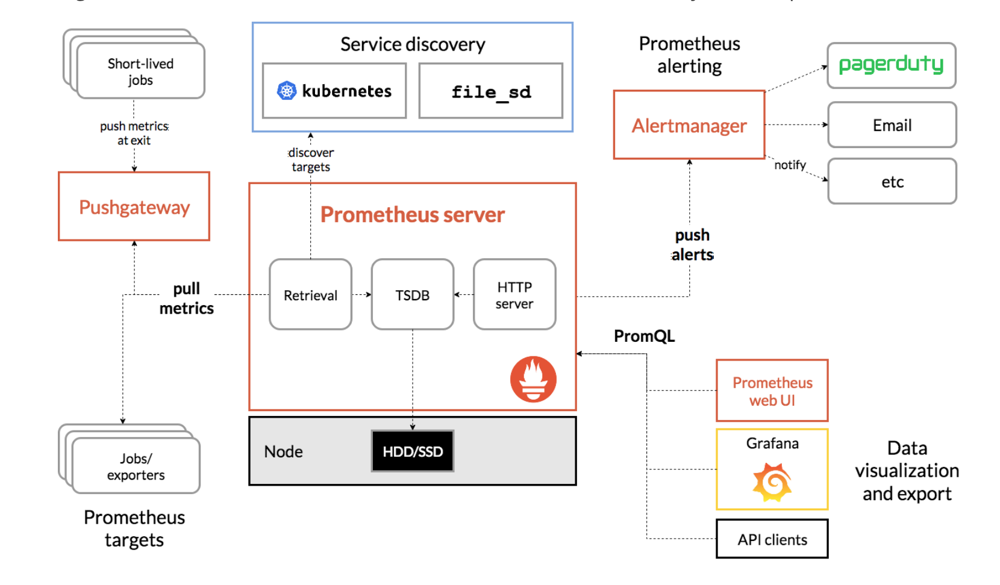

# Prometheus
> Prometheus下一代标准监控的基础设施，想法源自谷歌，产品毕业于CNCF，根正苗红。

## Prometheus数据类型

- 1. Counter，计数器，不断累加，比如注册用户数量
- 2. Gauge，测量值，不断摇摆，比如CPU使用量，内存使用量，在线用户量
- 3. Histogram，直方图，主要看分布，一般是中位数的二项式分布
- 4. Summary，看累计汇总指标，比如请求.99，表示99%的请求响应时间低于多少

以上数据存储在时序数据库里面，每一个指标除了有一个指标名称以外还有若干标签作group分组用。

## Prometheus数据采集方式

- Prometheus使用主动拉取的方式
- 中心管理节点叫做`Server`
- 工作节点叫做`Exporter`
- `Exporter`负责收集该节点的监控信息，`Server`定时去`Exporter`同步拉取。

对于临时的推送，Prometheus提供了一个叫做PushGateway的工作节点，用户可以把数据推到这里，然后`Server`再从这里拉取。没有违背pull模式。

## Prometheus 查询和操作接口语言`PromQL`
用户可以使用PromQL语法直接查询操作Prometheus数据，有很多第三方的图形化工具也可以使用PromQL读取数据并生动呈现，比如Grafana

## 告警

有一个专门负责告警的组件叫做 `AlterManager`。管理员可以设置告警规则，满足告警规则的条件，告警内容会被推送到AlterManager，然后由AlterManager统一处理。
告警有三种状态：
- 1.`Inactive`，非活跃，没有触发
- 2.`Pending`，满足条件，但是还在等待修复中，如果在for等待的时间内修复，不会触发，如果没有for等待的时间，默认直接触发。
- 3.`Firing`，触发，此时才会发送内容到AlterManager

有时候修复中需要临时关闭告警规则，可以在AlterManager设置silence，让告警保持静默状态。
告警的对象修复后，pending的告警状态会得到修复。
告警发到哪里可以在AlterManager定制，比如邮件或者webhook

## Prometheus监控实战

推荐指数：⭐️⭐️⭐️⭐️

关于关于Prometheus的书，这里推荐`Prometheus监控实战`
这本220页的书定价79，周末一天就可以看完。一本很薄的书不但节约你的空间，还能节约你的时间。估计这就是本书虽然薄但是贵的原因吧。本书内容简明准确，非常适合入门，看完本书对监控和使用Prometheus监控的全貌有一个完整的视图，强烈推荐！
另外本书作者还写了另外一本技术畅销书《第一本Docker书》，两本书同属`云原生生态`，也推荐!
