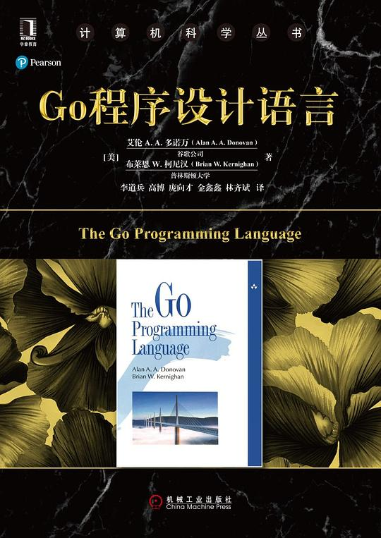

# go语言好书

## Head First Go语言程序设计

推荐指数：⭐️⭐️⭐️⭐️⭐️

一直以来比较喜欢经典描述的书籍，所以先买了那本《Go程序设计语言》看完，由于知识密度实在是太高，后面有点囫囵吞枣，甚至痛苦的看完，感觉自己并没有学会用go写代码。 后面也是由于豆瓣的好评买的，买来看排版以后第一印象居然是有点失望。不过后面看起来是真香，总共将近500页，花了四天的下班时间就看完了，看完本书甚至有一种我已经掌握了golang的快感，五星好评，这本书只讲了常用的部分，但是依然值得入手。可以和经典的那本互补。

## Go程序设计语言

推荐指数：⭐️⭐️⭐️⭐️⭐️

本书兼具广度和深度，不愧是K&R之一，每句话都是细节，千万不要囫囵吞枣错过。作者真的尽力用最少的篇幅最具深度的介绍了一门现代语言。强烈推荐 关于翻译：前面问题很少，后面三章错字很多，很多程序的输出也翻译了，这估计是译者之一，可见有多么的不负责任，真是丢脸。 尽管如此，依然推荐，如果英文不错，推荐看原版，如果更喜欢看电子书，也有别人翻译的，叫《go语言圣经》，低级的翻译错误反而没有

[《Go语言圣经》在线阅读](https://golang-china.github.io/gopl-zh/)
