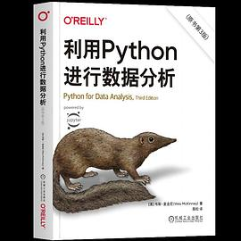

# python好书
> 初学则学习python最好的材料是官网的Tutorial

## 1. Python CookBook

推荐指数：⭐️⭐️⭐️⭐️⭐️

本书是python的APUE，如果学习python需要一本书的话，那只可能是这本。
阅读本书是一件愉快的事情，就像吃香蕉一样，读一章受益一章.
本书还有在线版本，翻译质量也很上乘

[python3-cookbook在线版](https://python3-cookbook.readthedocs.io/zh-cn/latest/copyright.html)

## 利用python进行数据分析

推荐指数：⭐️⭐️⭐️⭐️

这本是为数据分析人员而写的，值得一读
