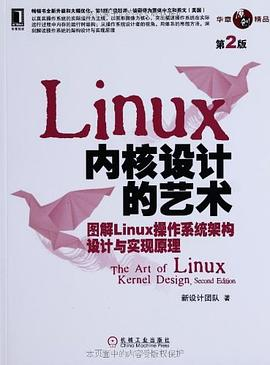
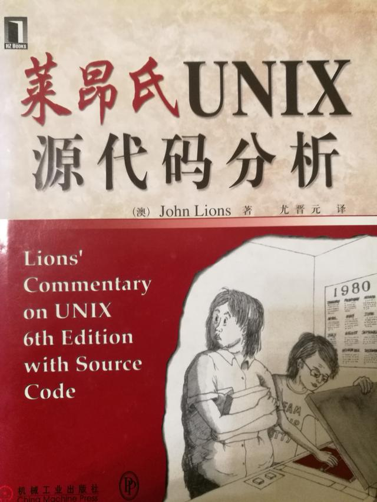
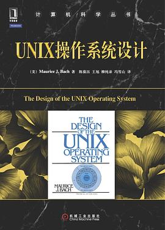
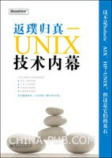

# 内核源代码阅读参考书

> 软件工程中将机制和策略分离的思想实在是太高明了。机制是比较稳定的，而策略不断的演化。我们能够从纷繁复杂的世界中学到知识。就是因为机制的稳定性。
> 操作系统领域也是。因为机制比较稳定，我们可以选取早期的源代码版本来阅读，麻雀虽小五脏俱全，通过阅读一个实际系统的代码，就可以很感性的感知操作系统的工作机制

## Linux内核完全剖析 基于0.11内核

推荐指数：⭐️⭐️⭐️⭐️⭐️

这本书细致的讲解linux0.11内核的每一行代码。从静态的工程的角度，解释内核的机制。顺带讲述当时涉及该版本代码的硬件知识，有些硬件现在依然在使用。本书还有一个配套网站，上面有linux0.11源代码和其他比较有价值的资料。

注意：本书有一个基于linux0.12的版本，里面有一些关于协处理器(浮点)的非本质的知识。建议还是选这个版本，请认准喽

## Linux内核设计的艺术

推荐指数：⭐️⭐️⭐️⭐️⭐️

本书与第一本的区别是，从操作系统启动到怠速，到执行每一个进程的角度讲解，动态的解释内核实际的运行视图，可以完美的与第一本互补。只挑选其中一本真的会有选择困难症，不过也许前一本内容更完整吧。

## 莱昂氏UNIX源代码分析

推荐指数：⭐️⭐️⭐️⭐️

这本书是讲unix操作系统内核的，因为涉及版权问题，长期不允许公开发行。现在能买到的纸质的也是盗版的。本书在地下黑客圈中享有很大的名气。本书描述的unix是在PDP11上实现的，看代码可以发现PDP11的编址与IA-32是很不同的，统一编制：IO设备有内存地址，寄存器也有内存地址

## UNIX操作系统设计

推荐指数：⭐️⭐️⭐️⭐️⭐️

严格来说，本书不是讲内核代码的。本书讲的是内核的数据结构和算法，非常清晰。说一个趣闻。
> Andrew S. Tanenbaum看了《莱昂氏UNIX源代码分析》写了minix和《操作系统设计与实现》
> 
> Linus看了《操作系统设计与实现》和《UNIX操作系统设计》写了linux

## 返璞归真：UNIX技术内幕

推荐指数：没看过

本书也是讲UNIX内核代码的，看他的定位还不错，出版时买了一本。但是我还没有看过，不做评价。
